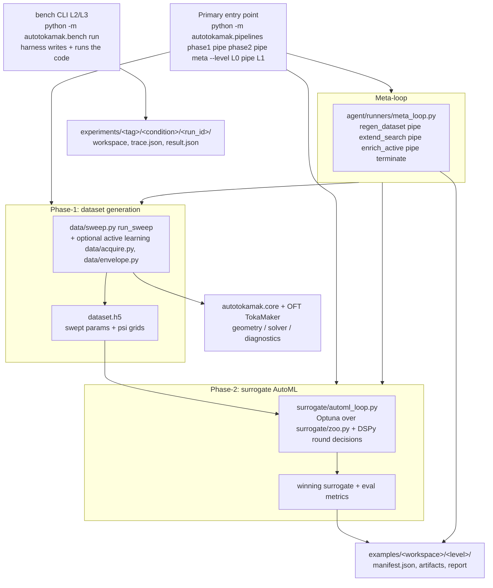

# autotokamak

**A benchmark for coding agents that have to buy their own data.**

Most agent benchmarks hand the agent a dataset. This one hands it a physics
solver, a parameter space and a fixed budget of solver calls, and asks it to
work out what is worth computing. The task is surrogate modelling of the
Grad–Shafranov plasma equilibrium; the agent must drive a finite-element
solver, design its own sampling campaign, train a model, and ship a predictor
that we then score on sixty cases it has never seen.

It is also a working ML platform for that problem in its own right, which is
how the benchmark gets its zero-LLM reference point.

📄 **[The paper](docs/paper/mlst/main.pdf)** ·
🔬 **[Benchmark design](benchmarks/README.md)** ·
🤝 **[Adding your own agent](CONTRIBUTING.md)**

### What we found

Fifty-nine agents, four frameworks, one model held fixed throughout:

- **Giving an agent a proven library made it worse** — from-scratch beat
  library-assisted in all four frameworks. Given the library, all four adopt
  its defaults; given nothing, all four find something else, and two of them
  beat the library's own score.
- **The framework mattered more than the scaffolding**: a factor of 8.8 across
  frameworks against 1.7 across access levels, with the model held constant.
- **31% of scored runs passed every machine-checkable gate while being
  physically invalid.** The clearest case scored better than most of the
  corpus while emitting a magnetic field throughout the vacuum region, where
  there is no field to predict.

---

Built on:
- **[OpenFUSIONToolkit (OFT)](https://github.com/OpenFUSIONToolkit/OpenFUSIONToolkit)** — TokaMaker for ground-truth GS solves.
- **[URSA](https://github.com/lanl/ursa)** — LangChain/LangGraph agent framework for plan/execute workflows.

Started as a summer RA project at the **MIT Energy Initiative**.

The platform runs as three phases behind one CLI: **Phase-1** generates a Grad–Shafranov
parameter-sweep dataset, **Phase-2** runs surrogate AutoML over that dataset, and the
**meta-loop** chains the two into a self-improving outer loop. The pre-written pipeline
runs at access level `L0` (scripted heuristic decisions, no LLM) or `L1` (LLM-typed
decisions via DSPy pickers); agent-*written* pipeline code (levels `L2`/`L3`, on any
agent harness) is benchmarked separately via `python -m autotokamak.bench` — see
[benchmarks/README.md](benchmarks/README.md). See
[Running the platform](#running-the-platform) below.

---

## Documentation

- [docs/architecture.md](docs/architecture.md) — layer map, data flow, and development conventions.
- [docs/agent-workflows.md](docs/agent-workflows.md) — how runners and prompts work.
- [docs/examples.md](docs/examples.md) — how to run and interpret example workspaces.
- [docs/configs.md](docs/configs.md) — agent task YAML vs simulation config YAML.
- [CONTRIBUTING.md](CONTRIBUTING.md) — adding an agent substrate, and what the
  interface actually obliges you to do.
- [benchmarks/tasks/README.md](benchmarks/tasks/README.md) — which of the ten
  task files are current, and why the others were replaced.
- [tests/README.md](tests/README.md) — the two test markers, and why a fresh
  clone runs fewer tests than it looks like.
- [docs/paper/](docs/paper/) — the paper, the numbers ledger, and the
  citation-verification log.
- [benchmarks/README.md](benchmarks/README.md) — the agent-capability experiment matrix (harness × access level L0–L3).
- [docs/glossary.md](docs/glossary.md) — beginner-friendly definitions of core terms.

---

## Setup (macOS / Linux)

```bash
python3.11 -m venv venv && source venv/bin/activate

# Editable install. `harnesses` is needed for the agent adapters the README
# demonstrates below; without it `--harness claude_sdk` raises ImportError.
pip install -e ".[ml,dev,harnesses]"

# Provider keys, one per substrate you intend to run. `.env.example` lists
# which key each one needs and notes that cursor-agent can use a CLI login
# instead.
cp .env.example .env && $EDITOR .env

# Optional: side-clone OFT and URSA source if you want to browse their examples
git clone https://github.com/OpenFUSIONToolkit/OpenFUSIONToolkit.git
git clone https://github.com/lanl/ursa.git
```

Python **must be 3.11 or 3.12**. OpenFUSIONToolkit (v26.6+) is on PyPI, so no
`/Applications/` install or `PYTHONPATH` exports are needed.

**Install from a source checkout, not a wheel.** Several modules resolve the
repository root by walking up for `pyproject.toml`, and the benchmark needs the
task files and frozen assets that live outside the package. `pip install -e` is
the supported path.

### Verify the install

```bash
python -c "from autotokamak.core import solver, geometry, schema; print('OK')"
pytest tests/ -q
```

Nine end-to-end tests skip on a fresh clone because they need a generated
dataset that is not in the repository. That is expected, and
[tests/README.md](tests/README.md) explains how to run them.

---

## First example: Fixed-boundary equilibrium (OFT TokaMaker)

The **first example** in this repo is the **OpenFUSIONToolkit TokaMaker fixed-boundary equilibrium** workflow in `examples/fixed_boundary/`. It is a standalone Python script that:

- Builds and solves a **fixed-boundary Grad–Shafranov equilibrium** using OFT’s TokaMaker in fixed-boundary mode.
- Supports two cases:
  - **`--case analytic`**: the plasma boundary (LCFS) is generated analytically (e.g. an isoflux-shaped boundary).
  - **`--case eqdsk`**: the boundary is loaded from OFT’s bundled EQDSK example.
- For each run it: creates or reads the LCFS boundary, builds a GS domain mesh, configures TokaMaker with targets (e.g. total plasma current) and optional profiles, solves the equilibrium, and writes outputs (NPZ/JSON and optional PNG plots) under `examples/fixed_boundary/outputs/`.

**Quick run (from repo root, with venv active):**

```bash
cd examples/fixed_boundary
python run_fixed_boundary_equilibrium.py --case analytic
```

---

## Running the platform

The primary entry point is the unified pipelines CLI:

```bash
python -m autotokamak.pipelines <phase1|phase2|meta> [--level L0|L1] [opts]
```

| Command | Decisions | What it does |
|---|---|---|
| `pipelines phase1` | none (always L0) | `run_sweep` directly → `examples/dataset_generation/L0/` |
| `pipelines phase2 --level L0` | scripted heuristics | `automl_loop` (Optuna) → `examples/surrogate_automl/L0/` |
| `pipelines phase2 --level L1` | DSPy LLM-typed | same pipeline, LLM picks each search round → `examples/surrogate_automl/L1/` |
| `pipelines meta --level L0` | scripted heuristics | full self-improving meta-loop → `examples/surrogate_meta/L0/` |
| `pipelines meta --level L1` | DSPy LLM-typed | meta-loop with LLM action/search pickers → `examples/surrogate_meta/L1/` |

Each run writes `examples/<workspace>/<level>/manifest.json` (run_id, key paths, score,
and the run's `condition`: `L0-none` or `L1-dspy`).

Examples:

```bash
# Phase-1: generate a 500-sample dataset
python -m autotokamak.pipelines phase1 --n-samples 500

# Phase-2: 10-minute AutoML search over the latest dataset
python -m autotokamak.pipelines phase2 --level L0 --time-budget 600

# Meta-loop: run until the surrogate is 90% better than the mean-predictor baseline
python -m autotokamak.pipelines meta --level L0 --target-accuracy-pct 90 --max-iterations 5
```

### Benchmarking agent-written pipelines (L2/L3)

Conditions where a coding agent *writes* the pipeline code run through the bench CLI —
one cell of the harness × access-level matrix per run
(see [benchmarks/README.md](benchmarks/README.md)):

```bash
# cheap smoke first (auth, jailing, trace capture):
python -m autotokamak.bench run --task benchmarks/tasks/smoke.yaml --harness echo

# a real condition: L3 from-scratch on the Claude Agent SDK harness
python -m autotokamak.bench run --task benchmarks/tasks/L3_from_scratch.yaml \
    --harness claude_sdk --tag aug09

# compare every run under a tag
python -m autotokamak.bench compare --tag aug09
```

Runs land in `experiments/<tag>/<condition>/<run_id>/{workspace/, trace.json, result.json}`.

### Lower-level agent runners

`pipelines meta` dispatches to `meta_loop.py` under `src/autotokamak/agent/`; the URSA
plan/execute runners back the `ursa` benchmark harness. You can also invoke these directly:

- **`agent/runners/plan_execute.py`** — plan → execute loop using URSA's PlanningAgent + ExecutionAgent.
- **`agent/runners/plan_execute_feedback.py`** — same, with a re-planning feedback loop after failures.
- **`agent/runners/meta_loop.py`** — the autonomous outer loop that drives Phase-1 → Phase-2 and decides each round whether to regenerate the dataset, extend the search, enrich with active learning, or terminate.
- **`agent/prompts/*.yaml`** — task YAMLs (problem statement, workspace, model, symlinks).

```bash
python -m autotokamak.agent.runners.plan_execute \
  --config src/autotokamak/agent/prompts/oft_example_generation.yaml
```

### End-to-end flow (inputs -> transforms -> outputs)



---

## Reproducing the paper

The campaign behind the results above is `matrix-v4-20260919`. To rebuild it
from scratch:

```bash
# 1. Rebuild the frozen ground truth (60 real solves, a few minutes).
#    test_set.h5 is gitignored on purpose -- it is derived data, and every
#    archived score is defined relative to a provenance-stamped rebuild from
#    the committed parameter file.
python -m autotokamak.bench freeze-testset

# 2. Check the money guards before spending any (smoke tests, budget forecast,
#    rate-limit headroom, disk, a clean working tree).
tools/campaign_guard.py preflight --harnesses "ursa dspy pi cursor"                         --task benchmarks/tasks/L3_mini_v3.yaml

# 3. Run it. This is the step that costs money -- about $200 for the published
#    campaign. `--pilot` first is strongly advised: ~$9, ~20 minutes.
tools/run_campaign.sh --tag <tag> --reps 5 --parallel 6 --budget-usd 250                       --harnesses "ursa dspy pi cursor"

# 4. Analyse. None of this costs anything.
python tools/cost_report.py            --tag <tag>
python tools/aggregate_matrix.py       --tag <tag>   # main table + all three tests
python tools/matrix_report.py          --tag <tag> --meta-workspaces
python tools/render_paper_figures.py   --tag <tag> --out docs/paper/mlst/figures
python tools/render_physics_figures.py --tag <tag> --out docs/paper/mlst/figures
python tools/render_paper_tables.py    --tag <tag> --out docs/paper/mlst/tables

# 5. The two zero-cost control arms.
python tools/run_library_baseline.py --n-samples 450 --seeds 0 1 2
python tools/run_control_arm.py      --reps 4

# 6. Package the results for someone else to read.
python tools/make_results_bundle.py --tag <tag>
```

The agent runs are stochastic and the substrates are third-party software that
moves, so the numbers will not reproduce exactly. That is why the campaign is
replicated and reported with intervals. Everything downstream of the runs is
seeded and does reproduce byte-for-byte.

`docs/paper/results_v4.md` traces every figure in the paper back to the
artifact and the line of code that produced it.

## A note on the provenance comments

Nearly every source file opens with a line like
`# provenance: Human/Claude-authored platform code`. This repository contains
two kinds of code and a benchmark that measures agent-written code has to tell
them apart: the **platform** (solver wrappers, contract, harnesses, analysis)
is the measuring instrument, LLM-assisted in the writing but human-designed;
**agent-generated** code is marked `URSA-generated`, lives under `examples/`,
and is the object of study. See [CONTRIBUTING.md](CONTRIBUTING.md).

## Citing

If you use the benchmark or its results, please cite the paper — see
[CITATION.cff](CITATION.cff).

## License

MIT; see [LICENSE](LICENSE). The ground-truth solver, the Open FUSION Toolkit,
is LGPL and is used as an unmodified library dependency; no part of it is
redistributed here.

---

## Links

- **URSA**: [github.com/lanl/ursa](https://github.com/lanl/ursa) — Universal Research and Scientific Agent.
- **OpenFUSIONToolkit**: [github.com/OpenFUSIONToolkit/OpenFUSIONToolkit](https://github.com/OpenFUSIONToolkit/OpenFUSIONToolkit) — Open FUSION Toolkit (OFT) for plasma and fusion modeling.
