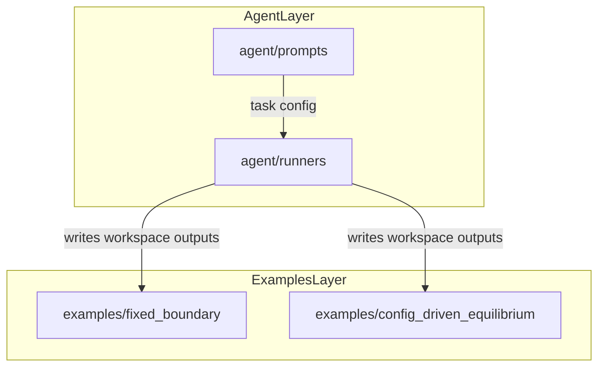

# Repository Architecture

This repository is intentionally split into two layers:

1. **Agent orchestration layer**: `agent/`
2. **Runnable simulation examples layer**: `examples/`

## Layer Boundaries

- `agent/prompts/` contains task YAML prompts for URSA-driven runs.
- `agent/runners/` contains Python entrypoints that invoke URSA (`PlanningAgent`, `ExecutionAgent`).
- `examples/` contains hand-runnable OpenFUSIONToolkit workflows and generated artifacts.

The agent layer can generate or update content in `examples/`, but the examples are runnable without LLM involvement.

## Data Flow

## Entry Points

- Agent run: `python -m agent.runners.plan_execute --config agent/prompts/oft_example_generation.yaml`
- Agent feedback run: `python -m agent.runners.plan_execute_feedback --config agent/prompts/oft_discretization_example.yaml`
- Fixed-boundary example: `python examples/fixed_boundary/run_fixed_boundary_equilibrium.py --case analytic`
- Config-driven example: `python examples/config_driven_equilibrium/run_equilibrium_from_config.py examples/config_driven_equilibrium/discretization_config.yaml`
