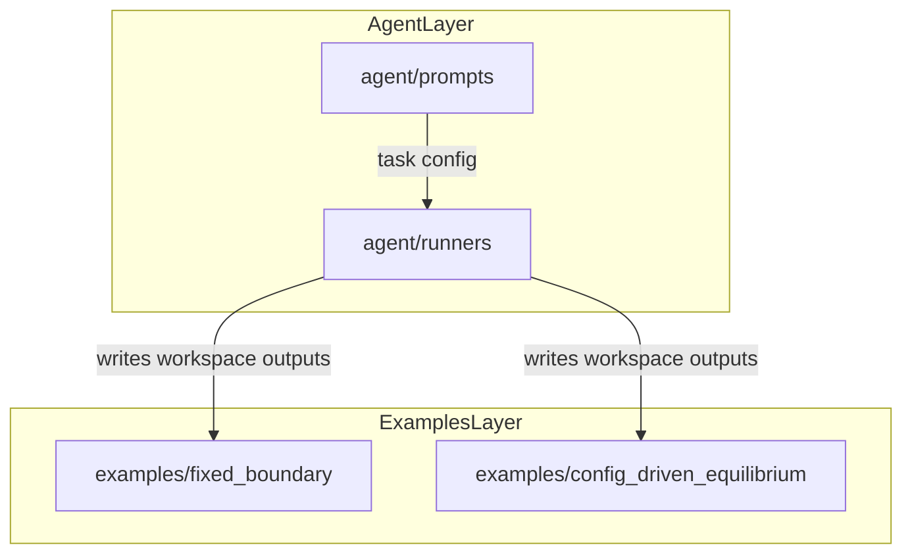

# Repository Architecture

This repository is the **`autotokamak`** package — a platform for ML surrogate
models of the Grad-Shafranov equation plus agentic LLM workflows that drive
TokaMaker simulations.

It is split into three layers:

1. **`autotokamak.core`** — shared library of geometry, solver, I/O, diagnostics, schema, and logging utilities used by every higher layer.
2. **Agent orchestration layer** (`src/autotokamak/agent/`)
3. **Runnable simulation examples layer** (`examples/`)

ML model code, training data pipelines, and evaluation harnesses live under
`src/autotokamak/{surrogate,data,models,eval}/` and are populated through
Weeks 2-6 of the research plan.

## Layer Boundaries

- `agent/prompts/` contains task YAML prompts for URSA-driven runs.
- `agent/runners/` contains Python entrypoints that invoke URSA (`PlanningAgent`, `ExecutionAgent`).
- `examples/` contains hand-runnable OpenFUSIONToolkit workflows and generated artifacts.

The agent layer can generate or update content in `examples/`, but the examples are runnable without LLM involvement.

## Data Flow

## Entry Points

- Agent run: `python -m autotokamak.agent.runners.plan_execute --config src/autotokamak/agent/prompts/oft_example_generation.yaml`
- Agent feedback run: `python -m autotokamak.agent.runners.plan_execute_feedback --config src/autotokamak/agent/prompts/oft_discretization_example.yaml`
- Fixed-boundary example: `python examples/fixed_boundary/run_fixed_boundary_equilibrium.py --case analytic`
- Config-driven example: `python examples/config_driven_equilibrium/run_equilibrium_from_config.py examples/config_driven_equilibrium/discretization_config.yaml`
- Tests: `pytest tests/ -v` (`-m slow` to include the full-solve smoke test)

## `autotokamak.core` API summary

| Module | Public functions | Used by |
|---|---|---|
| `geometry` | `build_lcfs`, `build_mesh`, `build_mesh_from_config` | Both example runners; future data sweeps |
| `solver` | `make_solver`, `solve_equilibrium` (retry-on-isoflux-fail) | `config_driven_equilibrium` runner; future surrogate evaluation |
| `io` | `atomic_write_text`, `atomic_savez`, `unified_output_dir`, `utc_run_id` | All runners that write artifacts |
| `diagnostics` | `extract_scalars` | Summary generation, eval metrics |
| `logging` | `log`, `section`, `kv` (libc-flushed) | All runners; keeps OFT compiled output in order |
| `schema` | `EquilibriumConfig`, `SweepConfig`, `InvertConfig` (Pydantic v2, `from_yaml`) | Config validation; Week 2+ sweep tooling |

## OFT singleton constraint

OpenFUSIONToolkit enforces **one `OFT_env` per Python kernel** — calling
`oft.OFT_env(...)` a second time raises. `core.solver.make_solver` accepts an
optional `env=` parameter for this reason: the retry path in
`solve_equilibrium` reuses the existing env rather than trying to create a
fresh one. Any batched solver (e.g. a training-data sweep that wants many
solves in one process) must follow the same pattern, OR run each solve in a
subprocess (which is what `examples/config_driven_equilibrium/forward_once.py`
does — recommended for sweeps).
