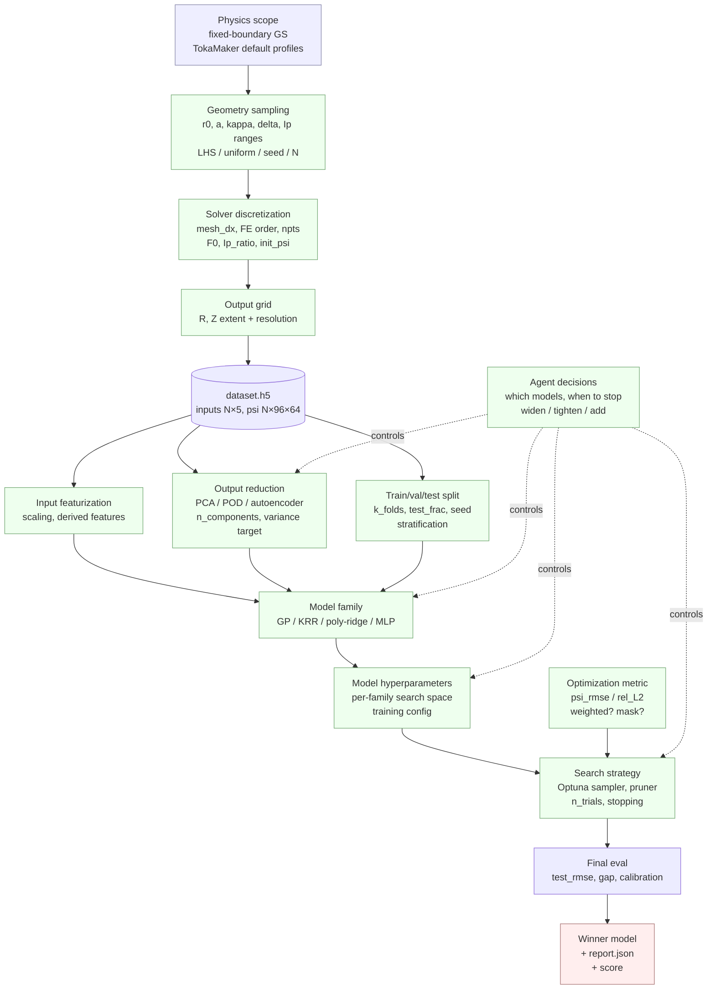
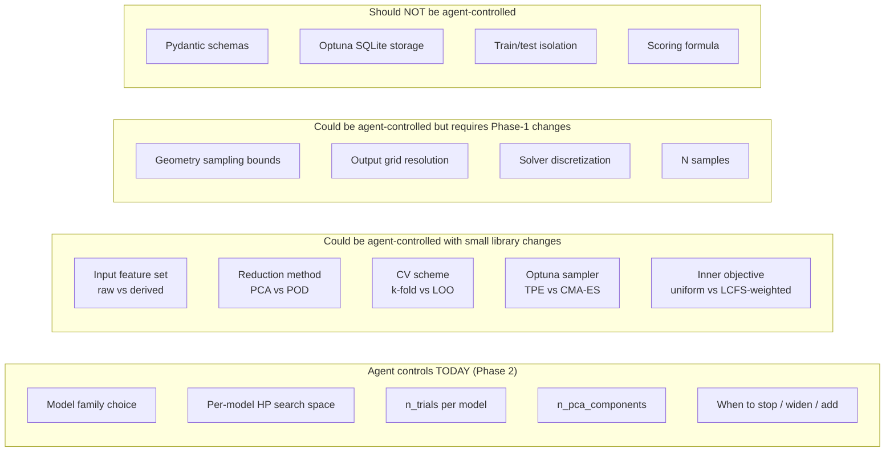

# Surrogate AutoML — the full search space

Status: living document. Last updated 2026-06-23.

This doc maps every knob that can affect the quality of the ML surrogate we
train to approximate the Grad–Shafranov solver. The point is to make the
landscape visible before we lock the Phase-2 AutoML search down to "just the
model hyperparameters" — because most of the leverage on surrogate quality
sits *outside* the model itself.

For project intent see [`project_agenda.md`](project_agenda.md). For the
current Phase-2 architecture see the Phase-2 plan and `surrogate_automl.yaml`.
For a priority-ordered list of models to try beyond the PoC zoo, see
[`surrogate_model_candidates.md`](surrogate_model_candidates.md).

---

## 1. The pipeline, with knobs at each stage

Legend: blue = fixed by PoC scope, green = a knob (someone or something
chooses its value), red = the artifact we ship.

Notice that the **agent** in Phase 2 currently only controls the bottom
right slice of the graph (model family + hyperparameters + search strategy).
The featurization and split knobs are made by us (in code) before the agent
sees the data. The physics/solver knobs were locked by the Phase-1 prompt.
Whether to push more of those upstream knobs into the agent's decision space
is an open architectural question — see §6.

---

## 2. Layer-by-layer enumeration

### Layer A — Physics scope

These define what the problem **is**. Changing them changes the answer to
"best surrogate," not the search over surrogates.

| Knob | Today | Tunable? | Lives where |
|---|---|---|---|
| Equation | Grad–Shafranov | Locked (PoC) | — |
| Boundary type | Fixed (LCFS prescribed) | Locked (PoC); free-boundary out of scope | `core/schema.py:BoundaryConfig` |
| Pressure / current profiles | TokaMaker defaults | Locked (PoC); could vary per sample later | `core/solver.py` |
| Tokamak family | One generic D-shape | Locked (PoC) | implicit |

Per `project_agenda.md` §6, these stay fixed for the PoC. Worth varying
them later once Phase-2 is shipping a stable answer.

### Layer B — Dataset generation knobs

These determine the data the surrogate sees. They're "fixed" from the
surrogate's point of view (the surrogate consumes a finished `dataset.h5`)
but a different choice here produces a different dataset and therefore a
different "best surrogate."

Layer B splits into **two orthogonal sub-axes** that are easy to conflate
but change the surrogate problem in completely different ways:

- **Geometry sampling** chooses *which* plasma configurations end up in
  the dataset. The 5 inputs `(r0, a, κ, δ, Ip)` define a tokamak shape +
  current; sampling picks which N points in that 5-D box we actually
  compute. → Affects the *domain* the surrogate must cover. Bad coverage
  → bad generalization to unseen shapes.
- **Solver discretization** chooses *how accurately* we compute ψ for
  each chosen shape. Once inputs are fixed, the GS equation still has to
  be solved on a finite mesh; the mesh size, FE polynomial order, and
  LCFS-contour point density determine the numerical accuracy of the ψ
  labels. → Affects the *fidelity* of each label. The surrogate's RMSE
  can never go below the FEM's own truncation error, no matter how good
  the model is.

Concretely: changing `n_samples` from 16 to 128 is a geometry-sampling
move; changing `mesh_dx` from 0.015 to 0.008 is a solver-discretization
move. They are not interchangeable knobs.

| Knob | Today | Tunable? | Lives where |
|---|---|---|---|
| **Geometry sampling distribution** | Latin Hypercube | Yes via `dataset_generation.yaml` | `sampling.method` |
| Geometry bounds (r0, a, κ, δ, Ip) | r0∈[.35,.55], a∈[.10,.20], κ∈[1.0,1.6], δ∈[0,.4], Ip∈[80k,200k] | Yes | `parameters` block |
| N samples | 16 | Yes (cheaply up to ~256; slow above) | `sampling.n_samples` |
| RNG seed | 0 | Yes | `sampling.seed` |
| **Solver discretization** | mesh_dx=0.015, order=1, npts=80 | Yes — directly affects ψ smoothness and what the surrogate has to learn | `fixed` block |
| F0 (toroidal field constant) | 0.10752 | Yes | `fixed.F0` |
| Ip_ratio | 1.0 | Yes | `fixed.Ip_ratio` |
| `init_psi.method` | `isoflux` | Yes | `fixed` block |
| isoflux constraint enforcement | Currently silently falling back to unconstrained | Buggy — see [`dspy_integration_plan.md`](dspy_integration_plan.md) §4 | `core/solver.py` |
| **Output grid** R | 64 pts in [0.15, 0.80] | Yes | `output_grid.R` |
| Output grid Z | 96 pts in [-0.40, 0.40] | Yes | `output_grid.Z` |

The two sub-axes trade off against each other under a fixed compute budget:

- **High N, coarse mesh**: many training points, each one a noisy
  approximation to the true ψ. Surrogate sees many shapes but learns a
  wobbly version of the field.
- **Low N, fine mesh**: few training points, each one a high-fidelity ψ
  field. Surrogate has clean labels but minimal coverage of the input
  space.

Which side of the trade is currently bottlenecking surrogate quality is
diagnosable with a **resolution sweep**: hold N fixed, vary `mesh_dx`,
retrain the surrogate. If RMSE drops as mesh refines, you're
label-noise-bottlenecked and refining is the next move. If RMSE plateaus,
you have enough mesh resolution and the bottleneck is sample density (or
model capacity, or featurization).

Skipping this diagnostic leads to a concrete waste: "the surrogate is bad
at N=16; let's go to N=128." That helps only if you were
sample-bottlenecked. If you were noise-bottlenecked, you just paid 8× the
compute for the same final RMSE.

Two more knobs in this layer matter more than they look:

- **Output grid resolution** drives the dimensionality of the regression
  target. Halving the grid quarters the PCA cost and roughly quarters the
  GP fit time. Doubling it is a separate experiment, not a hyperparameter.
- **isoflux constraint enforcement** is a *third* hidden axis: even with
  fixed sampling and discretization, the current dataset was produced
  with the LCFS-shape constraint silently off on every sample (see
  [`dspy_integration_plan.md`](dspy_integration_plan.md) §4). No surrogate
  hyperparameter compensates for that — the geometry inputs do not
  faithfully describe the saved ψ.

### Layer C — Featurization (inputs)

How we present the 5 physics parameters to the model.

| Knob | Today | Tunable? | Lives where |
|---|---|---|---|
| Raw features | `[r0, a, kappa, delta, Ip]` | Yes — could add derived terms | `eval/data.py:PARAM_ORDER` |
| Input scaling | None (poly-ridge has its own `StandardScaler`) | **Not currently exposed** | implicit per-model |
| Derived features | None | **Not currently exposed** | — |
| Categorical / discrete handling | N/A (all numeric) | — | — |

**Not exposed but interesting:**

- `aspect_ratio = r0 / a` is dimensionally meaningful; some surrogates
  learn faster with it.
- `Ip / (a^2 * B0)` (normalized current) collapses two correlated knobs into one.
- Log-scaling Ip helps if the bounds span a decade (they don't yet — 80k to
  200k — but they might in a larger regen).

This is the cheapest expansion of the search space: add a `feature_set`
choice ("raw" / "raw + derived" / "normalized only") and let the agent pick.

### Layer D — Featurization (outputs / reduction)

How we transform ψ before regressing on it. ψ is 6144-dimensional;
no classical regressor handles that natively on 16 samples.

| Knob | Today | Tunable? | Lives where |
|---|---|---|---|
| Reduction method | PCA (sklearn) | Limited to PCA | `eval/reduce.py:fit_pca` |
| `n_components` | Agent picks per round | Yes | `SearchSpec.n_pca_components` |
| Variance target | Soft 0.95 in prompt | Yes | prompt's REDUCTION CONTRACT |
| Fit scope | Per fold, train only | Locked | `surrogate/automl.py` |
| NaN handling | Replace with per-pixel train mean | Yes — could mask, could zero-fill | `eval/reduce.py:fit_pca` |
| Output scaling | None (PCA already centers) | — | — |

**Not exposed but plausible:**

- **POD instead of PCA** (proper orthogonal decomposition — same math
  underneath but uses physics-aware inner product, e.g. weighted by
  cell area). For axisymmetric ψ on a (R,Z) grid, this is a small change
  to the fit step.
- **Random projection** or **kernel PCA** for nonlinear modes.
- **Wavelet basis** if the ψ field has localized features.
- **Autoencoder** reduction (out of PoC scope — that's the deep-learning
  cousin of the zoo).

Reduction choice is the **second-highest-leverage** knob after model choice.
Worth letting the agent pick between PCA and POD in a later round.

### Layer E — Train / val / test split

| Knob | Today | Tunable? | Lives where |
|---|---|---|---|
| Split scheme | k-fold CV + held-out test | Yes via config | `surrogate_config.yaml` |
| `k_folds` | 4 | Yes | `SurrogateConfig.k_folds` |
| `test_frac` | 2/16 ≈ 0.125 | Yes | `SurrogateConfig.test_frac` |
| Random seed | 0 | Yes | `SurrogateConfig.seed` |
| Stratification | None (random shuffle) | **Not exposed** | `eval/data.py:kfold` |

**Not exposed but matters at N=16:**

- **LHS-stratified splits** would guarantee each fold covers the parameter
  ranges. With N=16 and random splits, a fold can easily have all-high-Ip
  training data and all-low-Ip validation, which makes the CV variance
  dominate the search signal.
- **Leave-one-out CV** is feasible at N=16 (~14× the cost of 4-fold but
  removes split-luck entirely). Worth toggling at small N.

### Layer F — Model family (the zoo)

Pre-bounded by the advisor to four classical sklearn models.

| Model | Strengths | Hyperparameters today |
|---|---|---|
| **GP** (`RBF + WhiteKernel`) | Uncertainty estimates, smooth interpolation, small-N friendly | `length_scale`, `noise_level`, `alpha` |
| **Kernel ridge** | Cheaper than GP, no uncertainty, similar bias profile | `alpha`, `gamma`, `kernel ∈ {rbf, laplacian}` |
| **Poly-ridge** | Interpretable, fast, biased toward low-frequency structure | `alpha`, `degree ∈ {1,2,3}` |
| **Small MLP** | Universal approximator, captures nonlinearities the kernel methods miss | `n_layers ≤ 2`, `layer_width ≤ 256`, `alpha`, `learning_rate_init` |

**Out of PoC scope** (per advisor, `project_agenda.md` §3): PINN, DeepONet,
FNO, gradient-boosted trees, random forests. Each adds its own hyperparameter
sub-tree.

**Within the zoo, not yet exposed:**

- For GP: kernel choice (Matérn 3/2, Matérn 5/2, RationalQuadratic) and
  composition (`RBF + Matern + WhiteKernel`).
- For MLP: activation function, optimizer choice (`lbfgs` for small N often
  beats `adam`), early-stopping settings.
- For poly-ridge: `interaction_only`, regularization-path solver (`sag`,
  `saga`, `cholesky`).

### Layer G — Training hyperparameters

Knobs that are not model architecture but affect fit quality.

| Knob | Today | Tunable? |
|---|---|---|
| MLP `max_iter` | 2000 | Locked in `surrogate/zoo.py:make_mlp` |
| MLP `random_state` | 0 | Locked |
| GP `n_restarts_optimizer` | sklearn default (0) | Locked |
| GP `normalize_y` | True | Locked |
| Pipeline `StandardScaler` (poly-ridge) | Always on | Locked |

These are reasonable defaults but each one is a hidden lever. If we ever
see "the MLP plateaus too early," raising `max_iter` is the first move.

### Layer H — Search strategy (Optuna's territory)

| Knob | Today | Tunable? | Lives where |
|---|---|---|---|
| Sampler | TPE (seeded) | Locked | `surrogate/automl.py:run_study` |
| Pruner | None | Locked | — |
| `n_trials` per model | Agent picks | Yes | `ModelSpec.n_trials` |
| Multi-fidelity | None | Not exposed | — |
| Parallelism | Sequential | Locked | — |
| Per-model search space | Agent picks from `DEFAULT_SEARCH_SPACES` and adapts | Yes | `surrogate/zoo.py` |

**Not exposed but defensible:**

- **CMA-ES** sampler does better than TPE on continuous spaces of dim < 20.
- **Hyperband / SuccessiveHalving** pruner would cut MLP cost.
- Number of CV folds inside the objective is currently fixed; the agent
  could choose to use cheap LOO at low budgets and 4-fold at high.

### Layer I — Optimization metric

What the inner objective minimizes. Today: full-grid RMSE in original
ψ units, averaged across folds.

| Knob | Today | Tunable? |
|---|---|---|
| Inner objective | `psi_rmse` (averaged over folds) | Hardcoded in `_cv_objective` |
| Metric space | Full grid after inverse-PCA | Locked (the right call) |
| Per-cell weighting | Uniform | Not exposed |
| Region of interest | Whole grid | Not exposed |
| Generalization penalty | None in objective; scored in metric | Not exposed |

**Not exposed but physics-relevant:**

- Weight cells inside the LCFS more than outside (the surrogate's outside
  prediction is mostly NaN-fill anyway).
- Weight cells near the magnetic axis more (the axis position is what
  drives q-profile, ELMs, etc.).
- Penalize predictions that violate physics: ψ should be smooth, the
  axis location should be unique, ∇²ψ should match the source.

### Layer J — Agent decisions (Phase-2 outer loop)

The agent's actions per round, currently:

| Decision | Today |
|---|---|
| Initial model set | Agent picks from `{gp, kernel_ridge, poly_ridge, mlp}` |
| Initial search space | Agent copies / narrows `DEFAULT_SEARCH_SPACES` |
| `n_trials` per model | Agent picks (prompt suggests 5–15) |
| `n_pca_components` | Agent picks per round |
| After-round action | `widen_range` / `add_model` / `tighten_around_best` / `terminate` |
| When to stop | Agent decides (prompt grades "decisiveness") |

This is where the "agentic" claim lives. Everything else in this doc is
either fixed by us or fixed by the library.

---

## 3. The "hidden" search space: data quality

Two things degrade surrogate quality without showing up as hyperparameters:

1. **Phase-1 silent fallback to unconstrained solves.** Per
   [`dspy_integration_plan.md`](dspy_integration_plan.md) §4, the current
   `dataset.h5` was produced with the isoflux constraint failing on every
   sample. The geometry inputs do not faithfully describe the saved ψ.
   No surrogate hyperparameter recovers from this; the only fix is to
   regenerate Phase 1 cleanly.
2. **N=16 is sample-starved.** GP and PCA both degenerate at small N. A
   regen at N=128 would shift several "best" choices (more PCA components
   become useful, MLP starts being competitive).

These two are not knobs in the AutoML sense — they're *prerequisites*. No
search over Layers C–J can compensate.

---

## 4. What the agent controls today vs what it could control

---

## 5. Where to focus next (recommendation)

Given the PoC budget (small N, no infinite LLM budget, advisor wants a
"reasonable surrogate picked by an agent"), here is the priority I'd
argue for:

| Priority | What to do | Why |
|---|---|---|
| **P0** | Fix Phase-1 isoflux fallback; run a resolution sweep to decide whether the next regen scales N (geometry sampling) or refines the mesh (solver discretization) | Layer-B data quality dominates everything downstream — and scaling the wrong sub-axis is a common, expensive mistake |
| **P1** | Expose **input feature set** to the agent (`raw` / `raw+aspect_ratio` / `normalized`) | Cheapest expansion, often gives 10–30% RMSE drop |
| **P1** | Expose **CV scheme choice** at small N (LOO vs k-fold) | Removes split-luck from the search signal |
| **P2** | Add **POD** as a reduction option | Physics-aware, modest library change |
| **P2** | Add **MLP activation + optimizer** to the search space | Small library change, real impact on the one nonlinear model |
| **P3** | Per-cell metric **weighting** by LCFS / axis region | Aligns the score with the physics consumer's actual need |
| **P3** | Multi-fidelity / pruning (Hyperband) | Only matters once trial budgets get big |
| **Defer** | New model families (PINN/DeepONet/FNO) | Out of PoC scope; explicitly excluded by advisor |
| **Defer** | Free-boundary, profile sweeps, multi-tokamak | Out of PoC scope |

The single highest-leverage move is **P0**: a better dataset moves
*everything*. The cheapest agent-side expansion is **P1**: adding the
feature-set choice is ~20 lines in `eval/data.py` and an extra field on
`SearchSpec`.

---

## 6. Architectural question this surfaces

We currently let the agent decide Layer J (and partially F, H). The
advisor's "on the fly, not fixed code" framing could push further: let
the agent decide Layers C, D, E too — and benchmark agentic decisions
against fixed-library defaults. That comparison is the publishable
result per `project_agenda.md` §3.

The argument for **keeping the library narrow** (status quo) is
measurement stability: if the agent rewrites the featurization each run,
scores aren't comparable across runs and DSPy optimization
(`dspy_integration_plan.md`) loses its substrate.

The argument for **giving the agent more knobs** is research novelty: an
agent that picks the right featurization for the dataset it sees is more
interesting than one that just tunes GP hyperparameters.

Probable resolution: ship the current Phase-2 (Layer J only). When stable,
add a *second* prompt that exposes Layers C+D to the agent. Score both on
the same regenerated N=128 dataset. The delta is the experiment.
